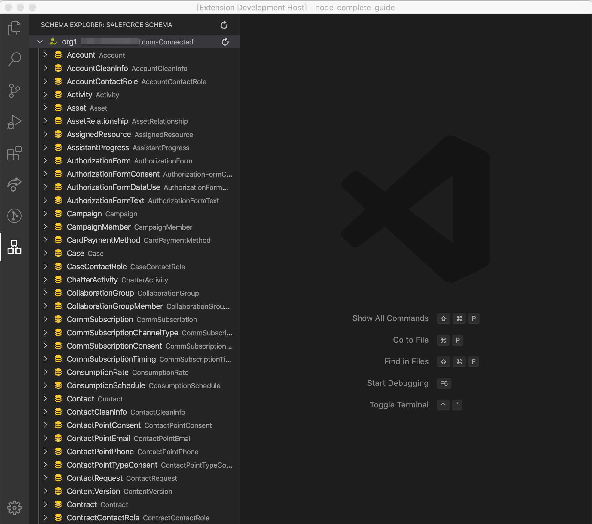
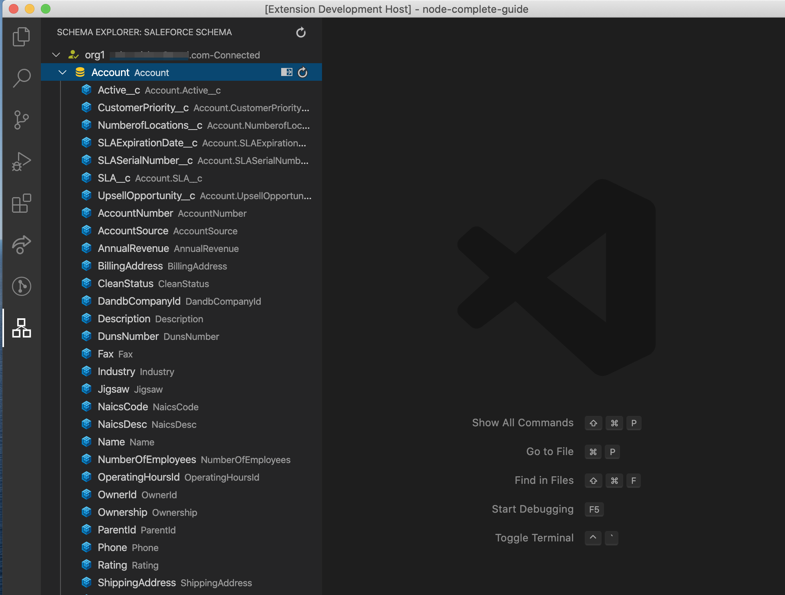
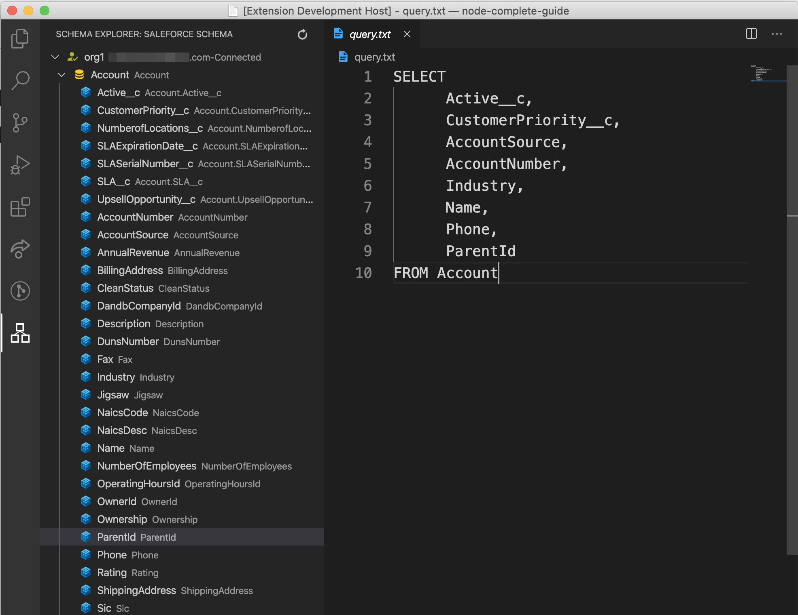

# Salesforce Schema Explorer

**Disclaimer** This is not an official extension from Salesforce.

First of all thanks to [Neha Mishra](https://github.com/NehaMishraGitHub) for all her contribution and I hope to see more PRs coming from her.
I always wanted this feature to be part of any Salesforce based IDEs from the day
I stopped using Force.com IDE (an eclipse plugin). It used to have a nice Schema Explorer and Query Builder.
This extension is in early beta kind of a phase and in no way close to it's inspiration (Force.com IDEs Schema Explorer). 
Also it does not guarantee production grade results and may have bugs. But still giving it a try will not break your system 
or project!:laughing: :stuck_out_tongue_closed_eyes: So please give it a try.

Provides ability to explore the schema, namely Objects and fields in a readable format from within the IDE. Also enables targetted retrieval of schema changes made in Salesforce just by clicking on a refresh icon. It also enable users to generate simple SOQL from within the IDE. This extension requires users to have SalesforceDX CLI installed on their computer and works with both scratch orgs and Non-scratch orgs. 

It is highly recommended to use with Salesforce Extension Pack to get all the other good things [salesforce official extension](https://marketplace.visualstudio.com/items?itemName=salesforce.salesforcedx-vscode) offers.

# Requirements

This VSCode extension works only once you have installed Salesforce CLI on your computer.

1. Install SFDX CLI from [here](https://developer.salesforce.com/tools/sfdxcli) based on your operating system.
2. Requires VSCode version 1.40 and beyond. May work in older versions. Have not tested though! 

# Features

1. **Get a list of all the orgs which has been authenticated using SFDX CLI**

2. **Shows Salesforce Objects from selected org.**

3. **Shows all the Fields from the selected Object.**

4. **Create a simple SOQL by clicking on the fields of your choice.**

*Note:* To use this feature user must be inside a VSCode Workspace/Project

# Issue Reporting/Feature Requests

You can reach out to me via my twitter handle @RonzGore or create a Git Hub :octocat: Issue [here](https://github.com/RonzGore/sf-schema-explorer/issues).
Please find the templates for issues and feature requests [here](https://github.com/RonzGore/sf-schema-explorer/blob/master/.github/ISSUE_TEMPLATE/bug_report.md) and [here](https://github.com/RonzGore/sf-schema-explorer/blob/master/.github/ISSUE_TEMPLATE/feature_request.md).
This is not a commercial Software and I built it during my spare time to solve a simple problem of
looking into Salesforce Object and field names without getting out of my IDE. So I may not be able
to immediately respond back to an issue or a feature.
Though there are definitely plans to improve and adding more features (Please go through the Roadmap section) 
and if you feel there is a feature which is worth, feel free to reach out to me or contribute 
as this Software is open source. PRs are super welcome!

# Roadmap (Not in any particular order) :rocket:

1. Orgs Management(View more info,create,delete, clone and edit)
2. Get Objects and fields metadata info (whether the field is updateable etc.)
3. Salesforce Deployable Package Creation and Management. Once this is out, the extension name made need to be changed as then it would no longer just be a Schema Explorer (This one is my favorite and my Admin friends will love it!) :hearts:
4. Inline insertion of fields and queries in your code files
5. Support for complex queries with relationships
6. Your requested or contributed features! :+1:

# Release Notes

Initial Version 0.1.5 released

# 
Enjoy!!
